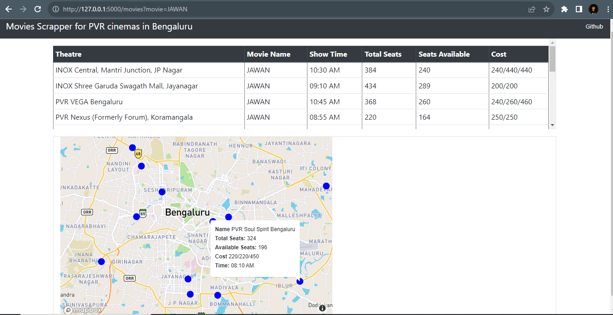

This is a simple Flask App that scrapes information from the PVR website for Bengaluru.
It uses Selenium for scraping. 
All the information rights reserved with PVR Cinemas. This project is only for learning purposes and is not meant to be put into production.  

Landing page:  
  

Main page:
  

